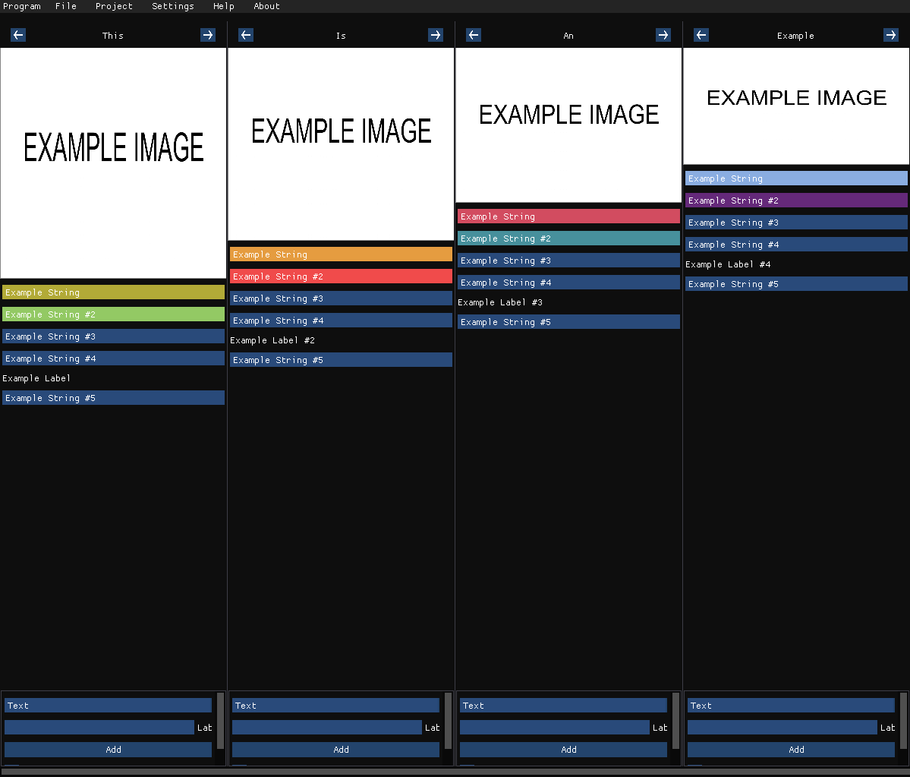

# Columns
Basic data viewer that uses columns to display data.

This project uses the ImGui library:
https://github.com/ocornut/imgui

# How to use
The executable requires the system folder that contains the images used by this software.
Additionaly, you can add new columns by clicking on "Add new column" and edit them by using
the options found at the bottom of each column. You can also edit each individual component
by right clicking it and you can select a component using the middle mouse button.

# Dependencies
This project needs the DirectX 9 SDK required by the ImGui library.
